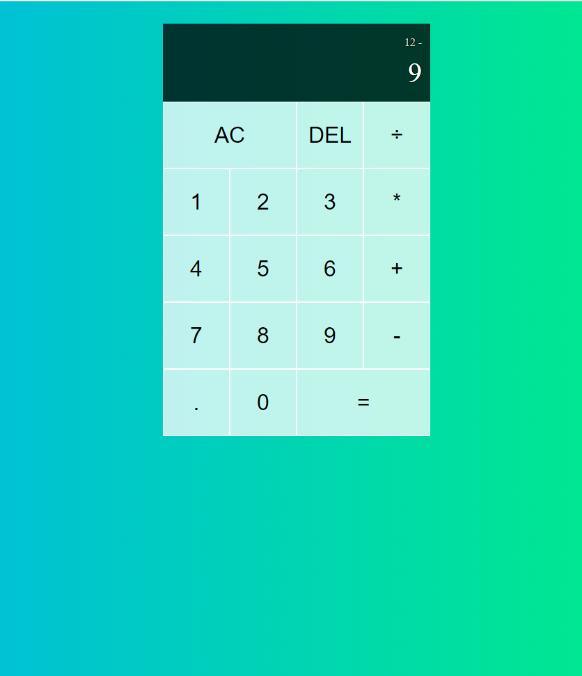

# Title
React Calculator

# Description
To get some more practice with my ReactJS skills, I created a simple calculator application capable of performing the four basic mathematical functions!

# Install/Usage Instructions
Simply clone the repository and run the command 'npm start' from the application directory.

# Application Screenshot

